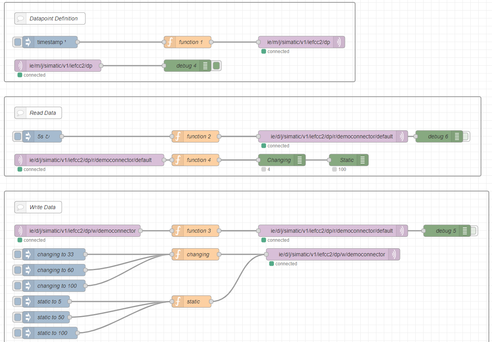
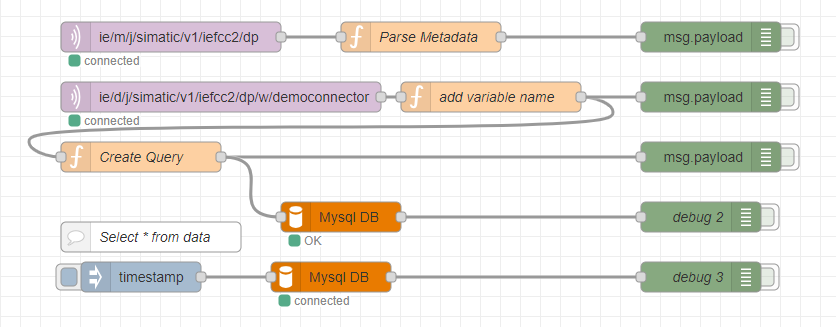

# Flow Creator / Node-Red
The following  examples you can use for testing around.


## Installation
1. * [Download or git clone folder](./)
2. * [Follow steps](./Nodered-App/)


## Flows - Buienradar
Getting Weatherdata of station Voorschoten in the Netherlands by HTTP Request


###### Code
```
[{"id":"b032af6fd2104aac","type":"tab","label":"Buienradar data","disabled":false,"info":"","env":[]},{"id":"e07044236a18a8da","type":"http request","z":"b032af6fd2104aac","name":"","method":"GET","ret":"txt","paytoqs":"ignore","url":"https://data.buienradar.nl/2.0/feed/json","tls":"","persist":false,"proxy":"","authType":"","senderr":false,"x":250,"y":140,"wires":[["bdac3f766c2c8cfa"]]},{"id":"5d62914bffa852e0","type":"inject","z":"b032af6fd2104aac","name":"","props":[{"p":"payload"},{"p":"topic","vt":"str"}],"repeat":"","crontab":"","once":true,"onceDelay":0.1,"topic":"","payloadType":"date","x":250,"y":60,"wires":[["e07044236a18a8da"]]},{"id":"f39d04888fb69338","type":"debug","z":"b032af6fd2104aac","name":"","active":true,"tosidebar":true,"console":false,"tostatus":false,"complete":"payload","targetType":"msg","statusVal":"","statusType":"auto","x":790,"y":400,"wires":[]},{"id":"bdac3f766c2c8cfa","type":"json","z":"b032af6fd2104aac","name":"","property":"payload","action":"","pretty":false,"x":390,"y":140,"wires":[["ee375970a7571005","654a2ec093bf66a0"]]},{"id":"ee375970a7571005","type":"function","z":"b032af6fd2104aac","name":"","func":"msg.payload = msg.payload.actual.stationmeasurements.find(item=> item.$id == '38')\nglobal.set('start_nr',1000)\n\nvar i = 0;\nvar start_nr = global.get('start_nr');\nvar message =  {\n    \"seq\": 1,\n    \"hashVersion\": 3635902760,\n    \"connections\": [{\n        \"name\": \"WeatherData\",\n        \"type\": \"API\",\n        \"dataPoints\": [{\n            \"name\": \"default\",\n            \"topic\": \"ie/d/j/simatic/v1/iefcc1/dp/r/WeatherData/default\",\n            \"publishType\": \"bulk\",\n            \"dataPointDefinitions\": []\n        }]\n    }]\n};\n\n\nfor (const property in msg.payload) {\n  var newMapObject =  { \"name\": \"\", \"id\": \"\", \"dataType\": \"Real\", \"accessMode\": \"r\", \"acquisitionCycleInMs\": 1000, \"acquisitionMode\": \"CyclicOnChange\" };\n  \n  if(i > 10){\n      newMapObject.name = property;\n      newMapObject.id = (start_nr + i).toString();\n      message.connections[0].dataPoints[0].dataPointDefinitions.push(newMapObject);\n  }\n  \n  i++;\n}\nmsg.payload = message;\nmsg.payload = msg.payload;\n\nreturn msg;","outputs":1,"timeout":"","noerr":0,"initialize":"","finalize":"","libs":[],"x":580,"y":320,"wires":[["7f2ba5467565dcd1","f39d04888fb69338"]]},{"id":"7f2ba5467565dcd1","type":"mqtt out","z":"b032af6fd2104aac","name":"","topic":"ie/m/j/simatic/v1/iefcc1/dp","qos":"2","retain":"true","respTopic":"","contentType":"","userProps":"","correl":"","expiry":"","broker":"def8073c42242c6f","x":830,"y":320,"wires":[]},{"id":"80f76b90adc16cb6","type":"function","z":"b032af6fd2104aac","name":"","func":"msg.payload = msg.payload.actual.stationmeasurements.find(item=> item.$id == '38');\n\nmsg.sequence = global.get('sequence');\nif(msg.sequence == undefined ){ global.set('sequence',0); msg.sequence = 0; };\n\nvar i = 0;\nvar start_nr = global.get('start_nr');\nvar message = {\n    \"seq\":msg.sequence,\n    \"vals\":[ ]\n}\n\nfor (const property in msg.payload) {\n  let now = new Date; \n  now = now.toISOString();\n  \n  var newMapObject =  {id: 0,qc: 3, ts: now, val: 0};\n  \n  if(i > 10){\n      newMapObject.id = (start_nr + i).toString();\n      newMapObject.val = msg.payload[property].toString();\n      message.vals.push(newMapObject);\n  }\n  i++;\n}\n\nglobal.set('sequence',msg.sequence + 1);\n\nmsg.payload = message;\nmsg.payload = msg.payload;\n\nreturn msg;","outputs":1,"timeout":"","noerr":0,"initialize":"","finalize":"","libs":[],"x":560,"y":580,"wires":[["4c13e090a25ae52f","694917ace9097a7b"]]},{"id":"4c13e090a25ae52f","type":"mqtt out","z":"b032af6fd2104aac","name":"","topic":"ie/d/j/simatic/v1/iefcc1/dp/r/WeatherData/default","qos":"2","retain":"false","respTopic":"","contentType":"","userProps":"","correl":"","expiry":"","broker":"def8073c42242c6f","x":900,"y":580,"wires":[]},{"id":"694917ace9097a7b","type":"debug","z":"b032af6fd2104aac","name":"","active":false,"tosidebar":true,"console":false,"tostatus":false,"complete":"payload","targetType":"msg","statusVal":"","statusType":"auto","x":790,"y":680,"wires":[]},{"id":"b538c80cae9fb54f","type":"delay","z":"b032af6fd2104aac","name":"","pauseType":"delay","timeout":"1","timeoutUnits":"seconds","rate":"1","nbRateUnits":"1","rateUnits":"second","randomFirst":"1","randomLast":"5","randomUnits":"seconds","drop":false,"allowrate":false,"outputs":1,"x":400,"y":480,"wires":[["e5d37a0dac8b2b9a"]]},{"id":"654a2ec093bf66a0","type":"function","z":"b032af6fd2104aac","name":"","func":"let now = new Date; \nnow = now.toISOString();\n\nmsg.payload = {\n    \"seq\":1,\n    \"ts\": now,\n    \"connector\":{\"status\":\"good\"},\"connections\":[{\"name\":\"PLC\",\"status\":\"good\"}]}; \n\nmsg.payload = msg.payload;\n\nreturn msg;","outputs":1,"noerr":0,"initialize":"","finalize":"","libs":[],"x":580,"y":140,"wires":[["744f1c2b7a29c169","0ce8df07e2286a00"]]},{"id":"744f1c2b7a29c169","type":"mqtt out","z":"b032af6fd2104aac","name":"","topic":"ie/s/j/simatic/v1/iefcc1/status","qos":"2","retain":"true","respTopic":"","contentType":"","userProps":"","correl":"","expiry":"","broker":"def8073c42242c6f","x":840,"y":140,"wires":[]},{"id":"0ce8df07e2286a00","type":"debug","z":"b032af6fd2104aac","name":"","active":false,"tosidebar":true,"console":false,"tostatus":false,"complete":"payload","targetType":"msg","statusVal":"","statusType":"auto","x":790,"y":220,"wires":[]},{"id":"be68c496327f98fa","type":"comment","z":"b032af6fd2104aac","name":"Status","info":"","x":750,"y":100,"wires":[]},{"id":"621e3bee6d0c070a","type":"comment","z":"b032af6fd2104aac","name":"Datapoints","info":"","x":760,"y":280,"wires":[]},{"id":"d0fd4c25eb0ada5d","type":"comment","z":"b032af6fd2104aac","name":"Data","info":"","x":750,"y":540,"wires":[]},{"id":"a96243041e923259","type":"inject","z":"b032af6fd2104aac","name":"","props":[{"p":"payload"},{"p":"topic","vt":"str"}],"repeat":"600","crontab":"","once":true,"onceDelay":"1","topic":"","payloadType":"date","x":250,"y":480,"wires":[["b538c80cae9fb54f"]]},{"id":"e5d37a0dac8b2b9a","type":"http request","z":"b032af6fd2104aac","name":"","method":"GET","ret":"txt","paytoqs":"ignore","url":"https://data.buienradar.nl/2.0/feed/json","tls":"","persist":false,"proxy":"","authType":"","senderr":false,"x":230,"y":580,"wires":[["b5cabb15548eef3f"]]},{"id":"b5cabb15548eef3f","type":"json","z":"b032af6fd2104aac","name":"","property":"payload","action":"","pretty":false,"x":370,"y":580,"wires":[["80f76b90adc16cb6"]]},{"id":"def8073c42242c6f","type":"mqtt-broker","name":"","broker":"ie-databus","port":"1883","clientid":"","autoConnect":true,"usetls":false,"protocolVersion":"4","keepalive":"60","cleansession":true,"autoUnsubscribe":true,"birthTopic":"","birthQos":"0","birthPayload":"","birthMsg":{},"closeTopic":"","closeQos":"0","closePayload":"","closeMsg":{},"willTopic":"","willQos":"0","willPayload":"","willMsg":{},"userProps":"","sessionExpiry":""}]
```
## Flows - ReadWrite 2 tags
Two simulated tags with read and write capabilities. 



```
[{"id":"95d7d7c01e0de169","type":"tab","label":"Demo ReadWrite connector","disabled":false,"info":"","env":[]},{"id":"279289f6c5757f63","type":"group","z":"95d7d7c01e0de169","style":{"stroke":"#999999","stroke-opacity":"1","fill":"none","fill-opacity":"1","label":true,"label-position":"nw","color":"#a4a4a4"},"nodes":["33cc52db63cd9f03","1fe7cdbc556e73d9","1c9659292454bfca","5be9abfdf724799f","dec3a3bc79cf14ad","e8e15fa99be96865"],"x":14,"y":39,"w":892,"h":202},{"id":"b27e7270737b3cb5","type":"group","z":"95d7d7c01e0de169","style":{"stroke":"#999999","stroke-opacity":"1","fill":"none","fill-opacity":"1","label":true,"label-position":"nw","color":"#a4a4a4"},"nodes":["488844ab66b8efa4","ed8b49cac5078c90","7a026e6ad9ea87fd","6cea396ed28c0978","4f8db7902c50bdd4","babb9f262885e2e5","5661202283b3315b","9b83b689a9815f5d","64a03809d26edaa6"],"x":14,"y":279,"w":1212,"h":202},{"id":"f9aa0bfc324c3777","type":"group","z":"95d7d7c01e0de169","style":{"stroke":"#999999","stroke-opacity":"1","fill":"none","fill-opacity":"1","label":true,"label-position":"nw","color":"#a4a4a4"},"nodes":["7a96863961761c8c","0be55cfb5926a396","fca148fb2e527e2a","71f2d56254930cfb","10f41fe62c41b899","45d3334cec54ec06","9c7fe556cd2540e3","eef18912ab7be170","efb6dca5b50cc92b","d75c3a358c3f630a","79e3d8d658a7b972","89880a0da9d20dd9","943d82fddf2363e8","8f5e432210179fe1"],"x":14,"y":519,"w":1232,"h":402},{"id":"33cc52db63cd9f03","type":"inject","z":"95d7d7c01e0de169","g":"279289f6c5757f63","name":"","props":[{"p":"payload"},{"p":"topic","vt":"str"}],"repeat":"","crontab":"","once":true,"onceDelay":0.1,"topic":"","payload":"","payloadType":"date","x":130,"y":140,"wires":[["1c9659292454bfca"]]},{"id":"1fe7cdbc556e73d9","type":"mqtt out","z":"95d7d7c01e0de169","g":"279289f6c5757f63","name":"","topic":"ie/m/j/simatic/v1/iefcc2/dp","qos":"2","retain":"true","respTopic":"","contentType":"","userProps":"","correl":"","expiry":"","broker":"def8073c42242c6f","x":770,"y":140,"wires":[]},{"id":"1c9659292454bfca","type":"function","z":"95d7d7c01e0de169","g":"279289f6c5757f63","name":"function 1","func":"msg.payload = {\n    \"seq\":1,\n    \"hashVersion\":3635902760,\n    \"connections\":[\n        {\n            \"name\":\"Democonnector\",\n            \"type\":\"flowcreator\",\n            \"dataPoints\":[\n                {\n                    \"name\":\"default\",\n                    \"topic\":\"ie/d/j/simatic/v1/iefcc2/dp/r/democonnector/default\",\n                    \"publishType\":\"bulk\",\n                    \"dataPointDefinitions\":[\n                        {\"name\":\"changing\",\"id\":\"50\",\"dataType\":\"Real\",\"accessMode\":\"rw\",\"acquisitionCycleInMs\":1000,\"acquisitionMode\":\"CyclicOnChange\"},\n                        {\"name\":\"static\",\"id\":\"51\",\"dataType\":\"Real\",\"accessMode\":\"rw\",\"acquisitionCycleInMs\":1000,\"acquisitionMode\":\"CyclicOnChange\"}\n                    ]\n                }\n            ]\n        }\n    ]\n}\nreturn msg;","outputs":1,"timeout":0,"noerr":0,"initialize":"","finalize":"","libs":[],"x":480,"y":140,"wires":[["1fe7cdbc556e73d9"]]},{"id":"5be9abfdf724799f","type":"debug","z":"95d7d7c01e0de169","g":"279289f6c5757f63","name":"debug 4","active":true,"tosidebar":true,"console":false,"tostatus":false,"complete":"false","statusVal":"","statusType":"auto","x":480,"y":200,"wires":[]},{"id":"dec3a3bc79cf14ad","type":"mqtt in","z":"95d7d7c01e0de169","g":"279289f6c5757f63","name":"","topic":"ie/m/j/simatic/v1/iefcc2/dp","qos":"2","datatype":"auto-detect","broker":"def8073c42242c6f","nl":false,"rap":true,"rh":0,"inputs":0,"x":150,"y":200,"wires":[["5be9abfdf724799f"]]},{"id":"488844ab66b8efa4","type":"inject","z":"95d7d7c01e0de169","g":"b27e7270737b3cb5","name":"5s","props":[{"p":"payload"},{"p":"topic","vt":"str"}],"repeat":"5","crontab":"","once":false,"onceDelay":0.1,"topic":"","payload":"","payloadType":"date","x":110,"y":380,"wires":[["4f8db7902c50bdd4"]]},{"id":"ed8b49cac5078c90","type":"mqtt out","z":"95d7d7c01e0de169","g":"b27e7270737b3cb5","name":"","topic":"ie/d/j/simatic/v1/iefcc2/dp/r/democonnector/default","qos":"2","retain":"true","respTopic":"","contentType":"","userProps":"","correl":"","expiry":"","broker":"def8073c42242c6f","x":850,"y":380,"wires":[]},{"id":"7a026e6ad9ea87fd","type":"debug","z":"95d7d7c01e0de169","g":"b27e7270737b3cb5","name":"Changing","active":true,"tosidebar":false,"console":false,"tostatus":true,"complete":"changing.val","targetType":"msg","statusVal":"payload","statusType":"auto","x":720,"y":440,"wires":[]},{"id":"6cea396ed28c0978","type":"debug","z":"95d7d7c01e0de169","g":"b27e7270737b3cb5","name":"Static","active":true,"tosidebar":false,"console":false,"tostatus":true,"complete":"static.val","targetType":"msg","statusVal":"payload.static","statusType":"auto","x":890,"y":440,"wires":[]},{"id":"4f8db7902c50bdd4","type":"function","z":"95d7d7c01e0de169","g":"b27e7270737b3cb5","name":"function 2","func":"msg.sequence = global.get('seqCounter');\nmsg.updown = global.get('updown');\nmsg.updowncount = global.get('updowncount');\nmsg.changing = global.get('changing');\nmsg.static = global.get('static')\n\nlet now = new Date; \nnow = now.toISOString();\nmsg.payload = {};\n\nswitch(msg.updown){\n    case \"up\":\n        if (msg.updowncount <= 5) { msg.updowncount = msg.updowncount + 1; };\n        if (msg.updowncount > 5) { msg.updowncount = 0; msg.updown = 'down'; };\n        msg.changing = msg.changing + 1;\n    break;\n    case 'down':\n        if (msg.updowncount <= 5) { msg.updowncount = msg.updowncount + 1; };\n        if (msg.updowncount > 5) {  msg.updowncount = 0; msg.updown = 'up'; };\n        msg.changing = msg.changing - 1;\n    break;\n}\n\n\nmsg.payload = {\n    \"seq\": msg.sequence,\n    \"vals\": [\n        { id: 50, qc: 3, ts: now, val: msg.changing },\n        { id: 51, qc: 3, ts: now, val: msg.static }\n    ]\n}\n\nglobal.set('seqCounter', msg.sequence + 1);\nglobal.set('updown', msg.updown);\nglobal.set('updowncount', msg.updowncount);\nglobal.set('changing', msg.changing);\nglobal.set('static', msg.static);\n\nreturn msg;","outputs":1,"timeout":0,"noerr":0,"initialize":"// Code added here will be run once\n// whenever the node is started.\nglobal.set('seqCounter',0);\nglobal.set('updown','up');\nglobal.set('updowncount', 0);\nglobal.set('changing', 0);\nglobal.set('static', 100)","finalize":"","libs":[],"x":500,"y":380,"wires":[["ed8b49cac5078c90","babb9f262885e2e5"]]},{"id":"7a96863961761c8c","type":"mqtt in","z":"95d7d7c01e0de169","g":"f9aa0bfc324c3777","name":"","topic":"ie/d/j/simatic/v1/iefcc2/dp/w/democonnector","qos":"2","datatype":"auto-detect","broker":"def8073c42242c6f","nl":false,"rap":true,"rh":0,"inputs":0,"x":200,"y":620,"wires":[["0be55cfb5926a396"]]},{"id":"0be55cfb5926a396","type":"function","z":"95d7d7c01e0de169","g":"f9aa0bfc324c3777","name":"function 3","func":"msg.changing = msg.payload.vals.find(item => item.id == \"50\")\nmsg.static = msg.payload.vals.find(item => item.id == \"51\")\n\nif(msg.changing != undefined){\n    global.set('changing', msg.changing.val)\n}\n\n\nif (msg.static != undefined){\n    global.set('static', msg.static.val)\n}\n\nreturn msg;","outputs":1,"timeout":0,"noerr":0,"initialize":"","finalize":"","libs":[],"x":500,"y":620,"wires":[["efb6dca5b50cc92b","71f2d56254930cfb"]]},{"id":"fca148fb2e527e2a","type":"mqtt out","z":"95d7d7c01e0de169","g":"f9aa0bfc324c3777","name":"","topic":"ie/d/j/simatic/v1/iefcc2/dp/w/democonnector","qos":"","retain":"","respTopic":"","contentType":"","userProps":"","correl":"","expiry":"","broker":"def8073c42242c6f","x":850,"y":680,"wires":[]},{"id":"71f2d56254930cfb","type":"debug","z":"95d7d7c01e0de169","g":"f9aa0bfc324c3777","name":"debug 5","active":false,"tosidebar":true,"console":false,"tostatus":false,"complete":"true","targetType":"full","statusVal":"","statusType":"auto","x":1140,"y":620,"wires":[]},{"id":"10f41fe62c41b899","type":"inject","z":"95d7d7c01e0de169","g":"f9aa0bfc324c3777","name":"changing to 100","props":[{"p":"payload"},{"p":"topic","vt":"str"}],"repeat":"","crontab":"","once":false,"onceDelay":0.1,"topic":"","payload":"100","payloadType":"num","x":140,"y":760,"wires":[["45d3334cec54ec06"]]},{"id":"45d3334cec54ec06","type":"function","z":"95d7d7c01e0de169","g":"f9aa0bfc324c3777","name":"changing","func":"let now = new Date; \nnow = now.toISOString();\nmsg.payload = {\n    \"seq\":0,\n    \"vals\":[\n        {\"id\":\"50\",\"qc\":3,\"ts\":now,\"val\":msg.payload},       \n    ]}\nreturn msg;","outputs":1,"timeout":0,"noerr":0,"initialize":"","finalize":"","libs":[],"x":500,"y":680,"wires":[["fca148fb2e527e2a"]]},{"id":"babb9f262885e2e5","type":"debug","z":"95d7d7c01e0de169","g":"b27e7270737b3cb5","name":"debug 6","active":false,"tosidebar":true,"console":false,"tostatus":false,"complete":"true","targetType":"full","statusVal":"","statusType":"auto","x":1120,"y":380,"wires":[]},{"id":"9c7fe556cd2540e3","type":"function","z":"95d7d7c01e0de169","g":"f9aa0bfc324c3777","name":"static","func":"let now = new Date; \nnow = now.toISOString();\nmsg.payload = {\n    \"seq\":0,\n    \"vals\":[\n        {\"id\":\"51\",\"qc\":3,\"ts\":now,\"val\":msg.payload},       \n    ]}\nreturn msg;","outputs":1,"timeout":0,"noerr":0,"initialize":"","finalize":"","libs":[],"x":490,"y":800,"wires":[["fca148fb2e527e2a"]]},{"id":"eef18912ab7be170","type":"inject","z":"95d7d7c01e0de169","g":"f9aa0bfc324c3777","name":"static to 5","props":[{"p":"payload"},{"p":"topic","vt":"str"}],"repeat":"","crontab":"","once":false,"onceDelay":0.1,"topic":"","payload":"5","payloadType":"num","x":120,"y":800,"wires":[["9c7fe556cd2540e3"]]},{"id":"efb6dca5b50cc92b","type":"mqtt out","z":"95d7d7c01e0de169","g":"f9aa0bfc324c3777","name":"","topic":"ie/d/j/simatic/v1/iefcc2/dp/r/democonnector/default","qos":"2","retain":"true","respTopic":"","contentType":"","userProps":"","correl":"","expiry":"","broker":"def8073c42242c6f","x":850,"y":620,"wires":[]},{"id":"5661202283b3315b","type":"mqtt in","z":"95d7d7c01e0de169","g":"b27e7270737b3cb5","name":"","topic":"ie/d/j/simatic/v1/iefcc2/dp/r/democonnector/default","qos":"2","datatype":"auto-detect","broker":"def8073c42242c6f","nl":false,"rap":true,"rh":0,"inputs":0,"x":230,"y":440,"wires":[["9b83b689a9815f5d"]]},{"id":"9b83b689a9815f5d","type":"function","z":"95d7d7c01e0de169","g":"b27e7270737b3cb5","name":"function 4","func":"msg.changing = msg.payload.vals.find(item => item.id == \"50\")\nmsg.static = msg.payload.vals.find(item => item.id == \"51\")\n\nreturn msg;","outputs":1,"timeout":0,"noerr":0,"initialize":"","finalize":"","libs":[],"x":500,"y":440,"wires":[["7a026e6ad9ea87fd","6cea396ed28c0978"]]},{"id":"d75c3a358c3f630a","type":"inject","z":"95d7d7c01e0de169","g":"f9aa0bfc324c3777","name":"static to 100","props":[{"p":"payload"},{"p":"topic","vt":"str"}],"repeat":"","crontab":"","once":false,"onceDelay":0.1,"topic":"","payload":"100","payloadType":"num","x":130,"y":880,"wires":[["9c7fe556cd2540e3"]]},{"id":"79e3d8d658a7b972","type":"inject","z":"95d7d7c01e0de169","g":"f9aa0bfc324c3777","name":"static to 50","props":[{"p":"payload"},{"p":"topic","vt":"str"}],"repeat":"","crontab":"","once":false,"onceDelay":0.1,"topic":"","payload":"50","payloadType":"num","x":120,"y":840,"wires":[["9c7fe556cd2540e3"]]},{"id":"89880a0da9d20dd9","type":"inject","z":"95d7d7c01e0de169","g":"f9aa0bfc324c3777","name":"changing to 60","props":[{"p":"payload"},{"p":"topic","vt":"str"}],"repeat":"","crontab":"","once":false,"onceDelay":0.1,"topic":"","payload":"66","payloadType":"num","x":140,"y":720,"wires":[["45d3334cec54ec06"]]},{"id":"943d82fddf2363e8","type":"inject","z":"95d7d7c01e0de169","g":"f9aa0bfc324c3777","name":"changing to 33","props":[{"p":"payload"},{"p":"topic","vt":"str"}],"repeat":"","crontab":"","once":false,"onceDelay":0.1,"topic":"","payload":"33","payloadType":"num","x":140,"y":680,"wires":[["45d3334cec54ec06"]]},{"id":"e8e15fa99be96865","type":"comment","z":"95d7d7c01e0de169","g":"279289f6c5757f63","name":"Datapoint Definition","info":"","x":130,"y":80,"wires":[]},{"id":"64a03809d26edaa6","type":"comment","z":"95d7d7c01e0de169","g":"b27e7270737b3cb5","name":"Read Data","info":"","x":100,"y":320,"wires":[]},{"id":"8f5e432210179fe1","type":"comment","z":"95d7d7c01e0de169","g":"f9aa0bfc324c3777","name":"Write Data","info":"","x":100,"y":560,"wires":[]},{"id":"def8073c42242c6f","type":"mqtt-broker","name":"","broker":"ie-databus","port":"1883","clientid":"","autoConnect":true,"usetls":false,"protocolVersion":"4","keepalive":"60","cleansession":true,"autoUnsubscribe":true,"birthTopic":"","birthQos":"0","birthPayload":"","birthMsg":{},"closeTopic":"","closeQos":"0","closePayload":"","closeMsg":{},"willTopic":"","willQos":"0","willPayload":"","willMsg":{},"userProps":"","sessionExpiry":""}]
```

## Flows - Write to SQL
Read the metadata iefcc2 (Flow creator Connector 2) data, query it and push it to SQL. 



```
[{"id":"f6f2187d.f17ca8","type":"tab","label":"MysqlDemo","disabled":false,"info":""},{"id":"3cc11d24.ff01a2","type":"comment","z":"f6f2187d.f17ca8","name":"WARNING: please check you have started this container with a volume that is mounted to /data\\n otherwise any flow changes are lost when you redeploy or upgrade the container\\n (e.g. upgrade to a more recent node-red docker image).\\n  If you are using named volumes you can ignore this warning.\\n Double click or see info side panel to learn how to start Node-RED in Docker to save your work","info":"\nTo start docker with a bind mount volume (-v option), for example:\n\n```\ndocker run -it -p 1880:1880 -v /home/user/node_red_data:/data --name mynodered nodered/node-red\n```\n\nwhere `/home/user/node_red_data` is a directory on your host machine where you want to store your flows.\n\nIf you do not do this then you can experiment and redploy flows, but if you restart or upgrade the container the flows will be disconnected and lost. \n\nThey will still exist in a hidden data volume, which can be recovered using standard docker techniques, but that is much more complex than just starting with a named volume as described above.","x":350,"y":80,"wires":[]},{"id":"3d5d58d9bf85f40b","type":"mysql","z":"f6f2187d.f17ca8","mydb":"44cbe2154ac07e61","name":"","x":360,"y":460,"wires":[["06ece88f4aeda2e9"]]},{"id":"9ca0aaa29d74744f","type":"inject","z":"f6f2187d.f17ca8","name":"","props":[{"p":"payload"},{"p":"topic","vt":"str"}],"repeat":"","crontab":"","once":false,"onceDelay":0.1,"topic":"select * from data","payload":"","payloadType":"date","x":160,"y":520,"wires":[["dc0127b9ae767ad2"]]},{"id":"06ece88f4aeda2e9","type":"debug","z":"f6f2187d.f17ca8","name":"debug 2","active":false,"tosidebar":true,"console":false,"tostatus":false,"complete":"false","statusVal":"","statusType":"auto","x":720,"y":460,"wires":[]},{"id":"7349421d9541f4d1","type":"comment","z":"f6f2187d.f17ca8","name":"Select * from data","info":"","x":170,"y":480,"wires":[]},{"id":"61735ee3f24c475b","type":"debug","z":"f6f2187d.f17ca8","name":"","active":false,"tosidebar":true,"console":false,"tostatus":false,"complete":"payload","targetType":"msg","statusVal":"","statusType":"auto","x":730,"y":280,"wires":[]},{"id":"7bcc81bdc470f9dd","type":"function","z":"f6f2187d.f17ca8","name":"Parse Metadata","func":"/*################################# \n    Init Variables\n#################################*/\nlet nameIDMap = new Map();          //global only changed here\n\n\n/*################################# \n    Check Payload\n#################################*/\nlet m = msg.payload;\nif (m.seq == undefined) {\n    return null;\n} \n\n\n/*################################# \n    Parse payload and store name and id to the NameIDMap\n#################################*/    \n\n// Iterate through connections\nm.connections.forEach(connection => \n{\n    \n        let dataPoints = connection.dataPoints;\n\n        //  Iterate through dataPoints\n        dataPoints.forEach( dataPoint => {\n            let dataPointDefinitions = dataPoint.dataPointDefinitions;\n\n            // Iterate through dataPointDefinitions\n            dataPointDefinitions.forEach(dataPointDefinition => {\n                nameIDMap.set(dataPointDefinition.id,dataPointDefinition.name);\n            });\n        });\n    \n});\n\n\n/*################################# \n    update global maps\n#################################*/  \nglobal.set(\"NameIDMap\", nameIDMap);\n\nmsg.payload = nameIDMap;\n\nreturn msg;\n\n\n","outputs":1,"timeout":"","noerr":0,"initialize":"","finalize":"","libs":[],"x":440,"y":280,"wires":[["61735ee3f24c475b"]]},{"id":"28cc063673c3f20d","type":"mqtt in","z":"f6f2187d.f17ca8","name":"","topic":"ie/m/j/simatic/v1/iefcc2/dp","qos":"0","datatype":"json","broker":"e76bf3713b759b30","nl":false,"rap":false,"inputs":0,"x":190,"y":280,"wires":[["7bcc81bdc470f9dd"]]},{"id":"b36c571b1fae1855","type":"mqtt in","z":"f6f2187d.f17ca8","name":"","topic":"ie/d/j/simatic/v1/iefcc2/dp/w/democonnector","qos":"0","datatype":"json","broker":"e76bf3713b759b30","nl":false,"rap":false,"inputs":0,"x":240,"y":340,"wires":[["e529270d748898d1"]]},{"id":"e529270d748898d1","type":"function","z":"f6f2187d.f17ca8","name":"add variable name","func":"var NameIDMap = global.get(\"NameIDMap\");\n\nmsg.payload.vals.forEach( item => {\n    item.variable = NameIDMap.get(item.id);\n})\n\nreturn msg;","outputs":1,"timeout":0,"noerr":0,"initialize":"","finalize":"","libs":[],"x":510,"y":340,"wires":[["b49df59f8c51ea7b","46a5b6ae03e71dcc"]]},{"id":"46a5b6ae03e71dcc","type":"debug","z":"f6f2187d.f17ca8","name":"","active":false,"tosidebar":true,"console":false,"tostatus":false,"complete":"payload","targetType":"msg","statusVal":"","statusType":"auto","x":730,"y":340,"wires":[]},{"id":"b49df59f8c51ea7b","type":"function","z":"f6f2187d.f17ca8","name":"Create Query","func":"var rows = msg.payload.vals;\n\nvar query = \"INSERT INTO data\"+\n \" ( Name, Value, Source )\"+\n\" VALUES \"\n\nrows.forEach(function(row) {\n    query = query + '(\"'+row.variable+'\", \"'+row.val+'\", \"fakeplc\"),'\n});\n\nquery = query.substring(0, query.length - 1);\nquery = query + ';'\n\nmsg.payload = query;\nmsg.topic = query;\n\nreturn msg;","outputs":1,"timeout":0,"noerr":0,"initialize":"","finalize":"","libs":[],"x":160,"y":400,"wires":[["714e3815a1ee22af","3d5d58d9bf85f40b"]]},{"id":"714e3815a1ee22af","type":"debug","z":"f6f2187d.f17ca8","name":"","active":false,"tosidebar":true,"console":false,"tostatus":false,"complete":"payload","targetType":"msg","statusVal":"","statusType":"auto","x":730,"y":400,"wires":[]},{"id":"dc0127b9ae767ad2","type":"mysql","z":"f6f2187d.f17ca8","mydb":"44cbe2154ac07e61","name":"","x":350,"y":520,"wires":[["fb9a433813384e9c"]]},{"id":"fb9a433813384e9c","type":"debug","z":"f6f2187d.f17ca8","name":"debug 3","active":false,"tosidebar":true,"console":false,"tostatus":false,"complete":"false","statusVal":"","statusType":"auto","x":720,"y":520,"wires":[]},{"id":"44cbe2154ac07e61","type":"MySQLdatabase","name":"Mysql DB","host":"db","port":"3306","db":"database","tz":"+01:00","charset":"UTF8"},{"id":"e76bf3713b759b30","type":"mqtt-broker","name":"","broker":"ie-databus","port":"1883","clientid":"","autoConnect":true,"usetls":false,"protocolVersion":"4","keepalive":"60","cleansession":true,"autoUnsubscribe":true,"birthTopic":"","birthQos":"0","birthRetain":"false","birthPayload":"","birthMsg":{},"closeTopic":"","closeQos":"0","closeRetain":"false","closePayload":"","closeMsg":{},"willTopic":"","willQos":"0","willRetain":"false","willPayload":"","willMsg":{},"userProps":"","sessionExpiry":""}]
```